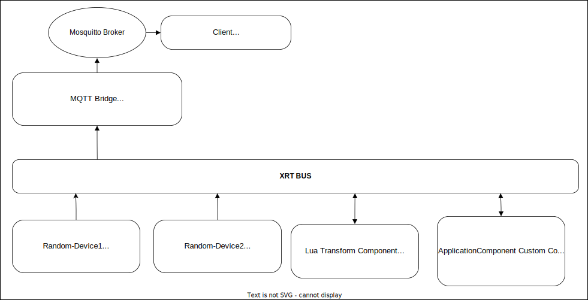

# Example XRT application component

## Overview

The aim of this example is to demonstrate how a custom component (app_component) can be built and loaded into Xrt and subsequently used alongside other components.

Included in this example are two Virtual Device Services, a Lua Transform Component, a custom component and an MQTT bridge component.

The two [Virtual Device Service](https://docs.iotechsys.com/edge-xrt20/device-service-components/virtual-device-service-component.html) are both setup with a scheduler. This scheduler reads from a resource on the device containing a random value and publishes this to the `"/xrt/devices/virtual/telemetry"` topic on the Xrt bus.

A [Lua Transform component](https://docs.iotechsys.com/edge-xrt20/transform-components/lua-transform-component.html) subscribes to this telemetry topic and transforms the data (multiplies the value by 10) before re-publishing the new values on the `"/xrt/lua/transformed_data"` topic.

The custom application component subscribes to the `"/xrt/lua/transformed_data"` topic. This component adds the two values from the different devices together and re-publishes the final result to the Xrt bus on the topic: `"/xrt/app_component/result"`.

Finally, an MQTT bridge component subscribes to the `"/xrt/app_component/result"` topic on the Xrt bus and re-publishes any message received on a MQTT topic `"/xrt/app_component/result"`.

Below is an illustration of the scenario described above:



## Prerequisites

XRT dev must be installed.

Environment variables can be set with the command:

```bash
cd ApplicationComponent
. ../CommonCommands/set_env_vars.sh
```

> _Note the dot before the path to the script, which is required to set the environment variables in the executing shell._

## Getting Started

### Build

First the custom component defined by app-component.c has to be built as specified by the MakeFile

This can be done as follows:

```bash
cd app-component
make
```

## Run

A configuration is provided which sets up the custom component as well as two devices generating random values. Run

```bash
xrt deployment/config
```

to start the Xrt instance with the example application component.
The logs should indicate that random values are being published to the bus, transformed and the result is republished.

## Application component structure

There are a couple of functions that have been implemented in order to support the state transitions of the application component that has been created in this example in the C language.

### app_component_alloc

Allocate component instances.

> **Note:** It is good practice to disable the publish/subscribe functionality in this function as the component may need time to initialize.

### app_component_start, app_component_stop, app_component_free

Start/stop/free the component and to update its state.

> **Note:** A component is made available to a container using the associated factory. It's up to you when and where you want to enable publish/subscribe functionality. It's good practice to enable it when the component starts and disable it upon stop.

### app_component_config

Provides the possibility to configure and access each individual field that has been set in the [`app_component.json`](../deployment/config/app_component.json) configuration file.

For example:
`const char * request_topic = iot_config_string (map, "RequestTopic", false, logger);`

In the above scenario the function `iot_config_string` is used to query the content of specified field: RequestTopic.

> **Note:** The `config` function gathers the information from the json file and will be used to allocate memory for each component.

The application component config in this example has the below unique lines:
`"RequestTopic":"/xrt/lua/transformed_data"` - topic to subscribe to
`"ReplyTopic": "/xrt/app_component/result"` - topic to publish data to

### app_component_callback

The **callback** function is implemented in a way that it subscribes to the request topic stream, filters the values from the readings of Random-Device1 and Random-Device2, adds them together then publishes the result back to the bus on the reply topic.

> **Note:** The device data has to be filtered out from a **map**. After the data has been processed, it has to be added back to it and the **map** itself will have to be published back to the bus under the specified reply topic.

### app_component_factory

In this example, the application component is dynamically loaded, therefore the app_component.json has the **Library** and **Factory** fields defined.
