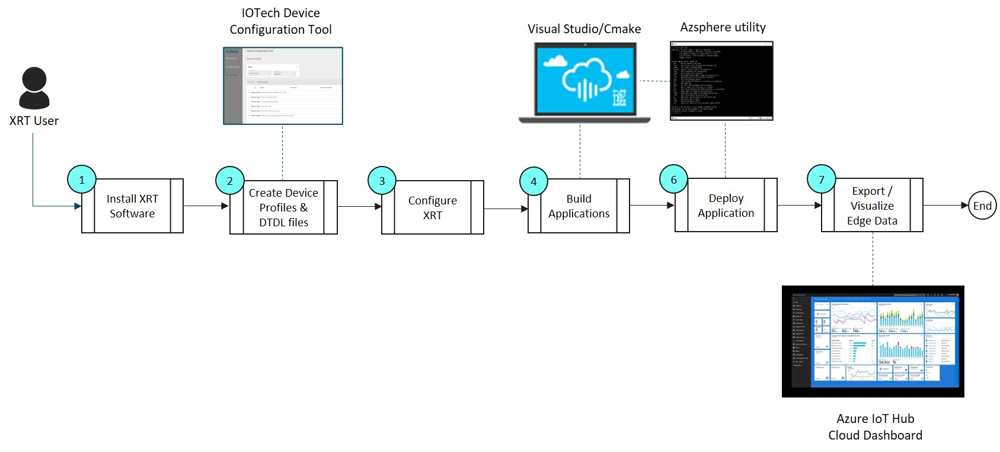

# XRT Azure Sphere

This document describes hows how to build a connected IoT application using IOTech's Edge XRT deployed on supported Azure Sphere hardware.

## Prerequisites

1. For Windows [Visual Studio](https://visualstudio.microsoft.com/downloads/) or Linux (Ubuntu 20.04) [Visual Studio Code](https://code.visualstudio.com/download}). Once installed open Visual Studio and install Visual Studio Extensions for Azure Sphere
2. The [Azure Sphere SDK](https://docs.microsoft.com/en-us/azure-sphere/install/overview) as appropriate for the target environment
3. The [Azure CLI](https://docs.microsoft.com/en-us/cli/azure/install-azure-cli) with the azure-iot extension installed

`az extension add --name azure-iot`

*Note - Examples might have prerequisites of there own, please check there readme.md with in there directory* 

## Supported Hardware
The exmaples currently support the following hardware:

* The Avnet Guardian 100 Azure Sphere module.
* The Avnet Azure Sphere Starter Kit (Cannot use a real device without Rev2 of the board and the addition of an ETH Click board)
* The Seed Azure Sphere Development Kit (Cannot use a real device without the addition of an Ethernet Shield)

## IOTech Device Configuration Tool

IOTech Device Configuration Tool (DCT) is a graphical tool that enables the definition and creation configuration files called Device Profiles, to define new OT device endpoint types and their properties to be compatible with XRT. The tool can be accessed as an online service at [Device Configuration Tool](https://dct.iotechsys.com/).

## XRT for Azure Sphere Development Process

The process for creating a connected Azure Sphere IoT application using XRT is illustrated in the following graphic.

The development process flow follows a standard sequence of steps:

* Install the XRT for Azure Sphere package on either a Windows or Linux (Ubuntu) host PC and then install the Azure Sphere demo project into Visual Studio.

* Using the IOTech [Device Configuration Tool](https://dct.iotechsys.com/) create a *Device Profile.json* configuration file representing the IoT device type. For example, Modbus, we create a Device Profile for the [Damocles2 Mini](https://www.hw-group.com/device/damocles2-mini) Modbus device. Using the same device definition, DCT can also be used to generate a Digital Twins Definition Language (DTDL) file representation for use with Digital Twins.

* Configure the appropriate *Device Service.json* (for example [modbus.json](config/modbus.json)) file specifying the device instance(s) that the XRT Device Service (e.g. Modbus) component will create at runtime based on the *Device Profile.json* file (e.g. [Damocles2-Mini.json](Damocles2-Mini.json)) created in the previous step.

* Configure the *Azure Export Service.json* file (e.g [azure.json](config/azure.json)) to specify the endpoint information needed by the XRT Azure Sphere Export Service to send data to and accept commands from IoT Hub. 

* Configure an a *Azure Application Manifest.json* (e.g [app_manifest.json](app_manifest.json)) file that describes the resources, also called application capabilities, that an application requires. Every application has an application manifest.

* Use Visual Studio (or cmake from the command line), to build the XRT Azure Application.

* From Visual Studio using the azsphere utility deploy the XRT Azure Application onto the Azure Sphere hardware module.

* Visualize the data on Azure IoT Hub and optionally send commands back to the connected IoT device.

Each of the above steps are covered in detail in the subsequent parts for each example.

## Development Host Setup

Before being able to build a example, you will need to install XRT
onto your host machine:

* [Installing the XRT Package on Windows](docs/windows-installation.md)
* [Installing the XRT Package on Ubuntu](docs/ubuntu-installation.md)

## Examples

* [Modbus Device](docs/modbus-example.md)
* [Virtual Device](docs/virtual-example.md)

# Tutorial Part 2 – Setting Up Digital Twins

In Part 1 of this tutorial we described how to create an Azure Sphere XRT application that can send data from a Modbus device to Azure IoT Hub and receive commands in the reverse direction .

Part 2 of the tutorial two shows how to interact with the same Modbus Device via an Azure Digital Twin.

For this part of the tutorial you should refer to the XRT for Azure Sphere Guide (**XRTAzureSphereUserGuide.pdf**). The guide is included in the XRT package that you downloaded and installed in Part 1.

Refer to the guide and complete the following steps:
1.	Setup Azure Cloud for Digital Twins – Create a Function App
2.	Setup Azure Cloud for Digital Twins – Create an Event Grid System Topic
3.	Create and Manage Digital Twins – Create Digital Twins Instance
4.	Create and Manage Digital Twins – Export Digital Twins Changes
5.	Create and Manage Digital Twins – Send Digital Twin Changes to IoT Hub
6.	Create and Manage Digital Twins – Add a Digital Twin

A video showing how to create a digital twin using the Explorer Tool as described in Step 7 above can be viewed at [Create a Digital Twin using the Explorer Tool](https://www.youtube.com/watch?v=CqTDkRXtsUU&feature=youtu.be).
