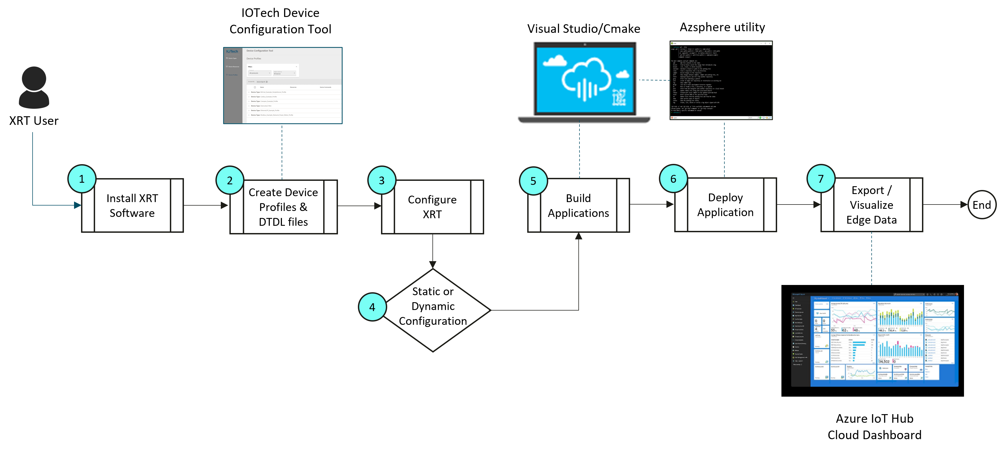

# Azure Sphere

This document describes, and gives examples on how to build a
connected IoT application using IOTech's Edge XRT deployed on
supported Azure Sphere hardware.

## Supported Hardware

The examples currently support the following hardware:

* The Avnet Guardian 100 Azure Sphere Module
* The Avnet Azure Sphere Starter Kit
* The Seeed Azure Sphere Development Kit
* The AILink SR620 Guardian Gateway

## Azure Sphere Development Process

The process for creating a connected Azure Sphere IoT
application using XRT is illustrated in the following graphic.



The development process flow follows a standard sequence of
steps:

1. Install the XRT for Azure Sphere package on either a Windows
  or Linux (Ubuntu) host PC and open one of the Azure Sphere
  examples with an IDE (Visual Studio for Windows).

2. Using the IOTech [Device Configuration Tool](https://dct.iotechsys.com/)
  create a *Device Profile.json* configuration file representing
  the IoT device type. For example, Modbus, we create a Device
  Profile for the [Damocles2 Mini](https://www.hw-group.com/device/damocles2-mini)
  Modbus device. Using the same device definition, DCT can also
  be used to generate a Digital Twins Definition Language (DTDL)
  file representation for use with Azure Digital Twins.

3. Configure the appropriate *Device Service.json* (for example
  [modbus.json](config/modbus.json)) file specifying the device
  instance(s) that the XRT Device Service (e.g. Modbus) component
  will create at runtime based on the *Device Profile.json* file
  (e.g. [Damocles2-Mini.json](config/profiles/Damocles2-Mini.json))
  created in the previous step.

   Configure the *Azure Export Service.json* file
  (e.g [azure-modbus.json](config/azure-modbus.json)) to specify the
  endpoint information needed by the XRT Azure Sphere Export Service to
  send data to and from Azure IoT Hub.

    Configure the *Azure Application Manifest.json* file
  (e.g [mt3620-g100/app_manifest.json](mt3620-g100/app_manifest.json))
  file that describes the resources, also called application
  capabilities, that an application requires. Every application has
  an application manifest.

4. At this point you have two options:

    1.	Include all of the individual configuration files for the build that are needed by the XRT application image that is going be deployed onto the Azure Sphere device. This option is useful if you do not require the ability to dynamically update the configuration of your application once deployed.

    2.	Copy the contents of the configuration files and create a single configuration file that can be loaded into the Azure Sphere Devive Twin running on Azure IoT Hub as described in the [Device Twin Configuration](https://docs.iotechsys.com/edge-xrt20/azuresphere/configuration/device-twin-configuration.html) section. Remove any build configuration not required to connect the Azure IoT hub. This approach is useful if you want to create a single application image that can support different configurations for each individual deployment.  Using this method the configuration for each XRT application deployed on an Azure Sphere device can be updated dynamically simply by changing the Device Twin’s configuration.

5. Build the XRT Azure Application with Visual Studio on Windows
  or using cmake from the command line.

6. Deploy the XRT Azure Application onto the Azure Sphere
  Module (You can deploy from Visual Studio using the azsphere
  utility).

7. Visualize the data on Azure IoT Hub and optionally send data
  back to the connected IoT device.

Each of the above steps are covered in detail in the subsequent
parts for each example.

## Prerequisites

* For Windows [Visual Studio](https://visualstudio.microsoft.com/downloads/) 
  or Linux (Ubuntu 20.04) [Visual Studio Code](https://code.visualstudio.com/download).
  Once installed open Visual Studio and install Visual
  Studio Extensions for Azure Sphere
* The [Azure Sphere SDK](https://docs.microsoft.com/en-us/azure-sphere/install/overview)
  as appropriate for the target environment
* You must have your Azure Sphere module claimed to your Azure
  Sphere Cloud Tenant in order for a XRT example to communicate
  with your Azure Cloud Resources. You can claim your device
  with the following [guide](https://docs.microsoft.com/en-gb/azure-sphere/install/claim-device?tabs=cliv1).
  You will also need to enable development on the
  Azure Sphere Model with:
  ```bash
  azsphere device enable-development
  ```

* The [Azure CLI](https://docs.microsoft.com/en-us/cli/azure/install-azure-cli)
  with the azure-iot extension installed. You can install
  azure-iot extension with the following:
  ```bash
  az extension add --name azure-iot
  ```

*Note - [Examples](#examples) might have prerequisites of
there own.*

## Install XRT On A Development Machine

You will need to install XRT onto your development machine to
build the examples:

* [Installing the XRT Package on Windows](docs/windows-installation.md)
* [Installing the XRT Package on Ubuntu](docs/ubuntu-installation.md)

## First time configuration setup

For first time configuration setup (right after cloning), run the setup_configs.sh script within the AazureSphere Directory:

```bash
cd AzureSphere
./setup_configs.sh
```

and follow on screen instructions

## Examples

* [BACnet Device](docs/bacnet-example.md)
* [Modbus Device](docs/modbus-example.md)
* [Ethernet/IP Device](docs/ethernetip-example.md)

## Using Azure Digital Twins With XRT Examples

To setup Azure Digital Twins refer to the XRT for [Azure Sphere Guide](https://docs.iotechsys.com/edge-xrt11/index.html). 

As decsribed in the guide complete the following steps:

* Setup Azure Cloud for Digital Twins – Create a Function App
* Setup Azure Cloud for Digital Twins – Create an Event Grid
  System Topic
* Create and Manage Digital Twins – Create Digital Twins
  Instance
* Create and Manage Digital Twins – Export Digital Twins
  Changes
* Create and Manage Digital Twins – Send Digital Twin Changes
  to IoT Hub
* Create and Manage Digital Twins – Add a Digital Twin

A video showing how to create a digital twin using the Explorer
Tool as described in "Add a Digital Twin" above can be viewed at
[Create a Digital Twin using the Explorer Tool](https://www.youtube.com/watch?v=CqTDkRXtsUU&feature=youtu.be).
