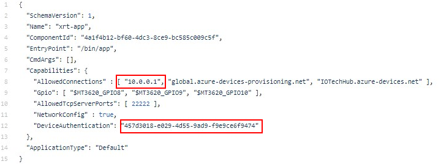

# XRT Azure Sphere Tutorial

This tutorial shows how to build a connected IoT application using IOTech Edge XRT deployed on an Azure Sphere Guardian 100 module. For this tutorial the XRT application is used to communicate with a Modus TCP/IP Device ([Damocles2 Mini](https://www.hw-group.com/device/damocles2-mini)), reading data values which are then sent to its digital twin running on Azure IoT Hub. Via the digital twin commands can also be sent back to the Modbus Device connected to the Guardian Module.

## Prerequisites

1.	All hands-on and setup are based on either Windows and Visual Studio or Linux (Ubuntu 20.4) and [Visual Studio Code](https://code.visualstudio.com/download})
2.	Up to date Visual Studio and [Azure Sphere SDK](https://docs.microsoft.com/en-us/azure-sphere/install/install-sdk?pivots=visual-studio#azure-sphere-sdk-for-visual-studio) for Visual Studio are installed on your host PC
3.	Either [ModbusPal](http://modbuspal.sourceforge.net/) Java Modbus simulator installed on your Windows or Linux host PC, or a  Damocles2 Mini connected by wired EtherNet to Guardian 100 module
4.	Azure IoT Hub setup (see instructions, attached pdf ?)
5.	Guardian 100 module hardware claimed by AzureSphere Cloud Tenant

## Hardware
This tutorial can be used with the Avnet Guardian 100 Azure Sphere module.

The Guardian 100 is a wireless edge module that uses Azure Sphere to deliver secure connectivity to devices. It includes Avnet Azure Sphere MT3620 module and connects to existing equipment via Ethernet or USB. Guardian-enabled devices also receive automatic security updates through the Azure Sphere Security Service.

## XRT for Azure Sphere Development Process

XRT enables users to created connected Azure Sphere applications for a range of industrial protocols (e.g. Modbus, BACNet, OPC UA etc). XRT provides users with the ability to create IoT applications by easily configuring a set of “deployment ready” components. XRT application development is supported by IOTech Device Configuration Tool (DCT) which is a graphical tool that enables the definition and creation configuration files called Device Profiles which are used to define new OT device endpoint types and their properties. The tool can be accessed as an online service at [Device Configuration Tool](https://dct.iotechsys.com/).

The process for creating a connect Azure Sphere IoT application using XRT is illustration in the following graphic.

  

The development process flow follows a standard sequence of steps:

Step 1:
*	Install the XRT for Azure Sphere package on either a Windows or Linux (Ubuntu) host PC and then install the Azure Sphere demo project into Visual Studio.
Step 2:
*	Using the IOTech [Device Configuration Tool](https://dct.iotechsys.com/) create a <Device Profile>.json configuration file representing the IoT device type. For example in this tutorial we will create a Device Profile for the [Damocles2 Mini](https://www.hw-group.com/device/damocles2-mini) Modbus device. Using the same device definition DCT can also be used to generate a Digital Twins Definition Language (DTDL) file representation for use with Azure IoT Hub.
Step 3:
*	Configure the appropriate <Device Service>.json specifying the device instance(s) that the XRT Device Service (e.g. Modbus) component will create at runtime based on the <Device Profile>.json created in the previous step. Also configure the  <Azure Export>.json file to specify the endpoint information need by the XRT Azure Sphere export send data to and accept command from IoT Hub.  
Step 4:
*	Using Visual Studio (or cmake from the command line) build the XRT Azure Application.
Step 5:
*	From Visual Studio using the azsphere utility  deploy the XRT Azure Application onto the Azure Shere hardware module (e.g. Guardian 100)
* Visualize the data on Azure IoT Hub and optionally send commands back to the connected IoT device. **TO BE COMPLETED**

Each of the above steps are covered in detail in the subsequent parts of this tutorial.

## Development Host Setup

### Installing the  XRT Package on Ubuntu

## Installing the XRT Package on Windows

1.	Downloading and install XRT package on Dev Host (Ubuntu and Windows ?)
2.	Visual Studio project installation Steve

### Visual Studio Setup

## Example Application

The Azure Sphere example application demonstrate how to use XRT to communicate with a Modus TCP/IP Device (Damocles2 Mini) or alternatively if you do not have access to a physical device a Java Modbus simulator (ModbusPal) can be used instead of the real hardware.
If the Damocles hardware is used then it must be connected to the Guardian 100 module via a wired Ethernet connection.
If the simulator is used it can be installed

The Damocles2 mini is a smart I/O controller used for remote monitoring and control of sensors and devices. It provides 4 digital dry contact inputs and 2 digital relay outputs that can be accessed via a Modbus interface.

The Azure Sphere example application reads the digital input and output values from the Modbus device via the Modbus Device Service component and publishes the data onto the internal XRT bus. A Lua Scripting component subscribes to these values and checks for any digital input or output states changes. Only if changes are detected is data is re-published onto the bus. An Azure Export component subscribes to these changes and pushes the data values to an Azure IoT Hub endpoint.  Via the Damocles2 Mini digital twin instantiation on IoT Hub, methods can be called to send commands back down to the XRT application running on the Azure Sphere module to set the digital output values. Command values are received by the Azure Export component and published onto the XRT bus. The Modbus Device Service subscribes to these commands and sets the value of the two digital outputs on the Damocles2 Mini.

Note the digital outputs on the device are wired to the digital inputs on the device. In this way output values are automatically mirrored by the digital inputs.   

### Creating a Modbus Device Profile and DTDL generation using the DCT

As described in the previous section (Step 2) to connect to a new device via XRT you must first create a Device Profile for the specific device type and in the case of this example a corresponding DTDL file.
Device Profiles and DTDL files can created using IOTech’s [Device Configuration Tool](https://dct.iotechsys.com/). A video showing you how to do this can for the Damocles2 Mini device can be accessed at [DCT Modbus Tutorial Video](https://www.youtube.com/watch?v=sj1hC7S4uE4).
The configuration files generated from the tool are as follows:
*	[Damocles2 Mini Device Profile](Damocles2-Mini.json)
*	[Damocles2 Mini DTDL file](Damocles2-Mini.dtdl)

### Running the ModbusPal Simulator

* Download the ModbusPal jar file.
* Run the simulator with the command:

`java -jar ModbusPal.jar`

* Use the "Load" button and select the damocles.xmpp file. This provides a simulation of a simple Modbus devices with 4 binary inputs and two binary outputs.
* Start the simulator with the "Run" button.
Configuring XRT for use with Guardian 100 or Modbus simulator
In order to deploy the example application and enable it connect to the Modbus simulator (or a real Damocles2 Mini device)  then you must configure the following config files for the XRT Modbus Device Service component and the Azure Sphere manifest to use the IP address of your PC.

* Edit app_manifest.json and replace 10.0.0.1 with the IP address of your PC

* Edit config/modbus.json replace 10.0.0.1 with the IP address of your PC

  

To connect the example to your IoT Hub endpoint you must also configure Azure Export Service component.

* Edit config/azue.json and replace TO BE COMPLETED

### Building The Application

Issue the command:

`make`

### Deploying the Application

In another shell issue the command:

`/opt/azurespheresdk/Sysroots/7/tools/sysroots/x86_64-pokysdk-linux/usr/bin/arm-poky-linux-musleabi/arm-poky-linux-musleabi-gdb xrt-app.out`

### Debugging the Application

In gdb issue the commands:

`set sysroot /opt/azurespheresdk/Sysroots/7`

`target remote 192.168.35.2:2345`

`continue`

Observe the debug output in the terminal where the make command was issued. The simulated Modbus device inputs are read at an interval specified in the Modbus device service configuration.

## Tutorial Part 2 – Setting Up Digital Twins
