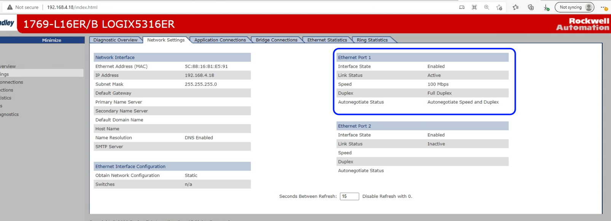

# Ethernet-IP Device

In this Ethernet-IP example, XRT connects to a Allen Bradley PLC that is assumed to have preprogrammed tags. Values are read from the PLC and pushed to a Azure IoT Hub.

An example of connecting to the Allen Bradley PLC using wired Ethernet is given in this guide.

## AzureSphere Hardware

## Prerequisites

*Note - The prerequisites found on the main [readme.md](https://github.com/IOTechSystems/xrt-examples/blob/master/AzureSphere/README.md) are required for this example*

- Allen Bradley PLC or other EIP device

## Configuration

In-order for the Ethernet-IP Example to work, you will need to edit some of the configurations. The configurations that are required to be edited will have "(required)" within their title.

### Device Profile

A sample Ethernet-IP device profile for an Allen Bradley PLC can be found at: configs/profiles/allen-bradley-azure.json.

The Device profile contains a config of different deviceResources that can be sent or received from the Azure IoT Hub.

Edit this file with the corresponding tag names you wish to read/write to within the desired PLC

### Azure (Required)

The Azure config file can be found at: configs/azure-ethernetip.json

You will need to configure some values in azure.json to be able to send values to the IoT Hub. You will need:

- DeviceID, can be found for a USB connected device with the command:

  ```
  - azsphere device list-attached
  ```

  HostName, Is the IOT Hub host name and can be found using the Azure Portal or using the command (replace HubName with the name of your IOT hub):

- ```
  az iot hub show --name <HubName> | grep hostName
  ```

- ScopeID, The Device Provisioning Service ID Scope can be found using the portal or the command (replace DPSName with the name of your Device Provisioning Service):

  ```
  - az iot dps show --name <DPSName> | grep idScope
  ```

### App Manifest (Required)

- Edit the [mt3620-g100/app_manifest.json](../mt3620-g100/app_manifest.json) file and set DeviceAuthentication to your tenant id and replace IOTechHub with your IoT Hub name in AllowedConnections:

  ```
  azsphere tenant list
  ```

- Add the ip address of the Allen Bradley PLC device that will be communicating with XRT, to the `AllowedConnections` JSON array.

### pool.json (Optional)

- If many scheduels have been set it will be a good idea to edit the [pool.json](../config/pool.json) file and set maxjobs to a lower number and reduce threads to 1 to avoid crashes and memoy issues.

## Building The Application

You can build the EthernetIP Example following the links below:

- [Building on Windows](https://github.com/IOTechSystems/xrt-examples/blob/master/AzureSphere/docs/windows-deploy-debug.md)
- [Building on Ubuntu](https://github.com/IOTechSystems/xrt-examples/blob/master/AzureSphere/docs/ubuntu-build.md)

## Ethernet/IP Azure Driver Options

The Azure version of the Ethernet/IP device service has some extra driver options that need to be configured before deploying and running on the Azure device:

```
"Driver": {
        "NetworkInterface": "eth0",
        "MacAddress": "c2:25:80:93:36:98",
        "FullDuplex": true,
        "NetworkSpeed": 1000
    },
```

- **NetworkInterface** - The wired network interface on the azure device - can be found using `azsphere device network list-interfaces` 
- **MacAddress** - The mac address of the chosen network interface on the azure device - can be found using `azsphere device network list-interfaces` 
- **FullDuplex** - State if the device is full-duplex or not - Can usually be found from the http webpage of the PLC or other device that is connected to the same network - see image below.
- **NetworkSpeed** - The network speed of which the device is connected to - can be found from the http webpage of the PLC or other device that is connected to the same network - see image below.



## Adding Devices

To provision a device on XRT with the Ethernet/IP device service, two things are needed

- The Device Profile
- The IP Adress of the device

These are added to the ethernetip.json config file under "Devices":

```
 "Devices":{
        "Allen-Bradley-Azure": {
            "profile": "Allen-Bradley-Azure",
            "protocols": {
                "IP": {
                    "Address": "192.168.4.18"
                }
            }
        }
    },
```

 ## Setting Up Schedules

Schedules have to be setup before deploying and running XRT, schedules require 3 parameters:

- The Device name
- The Desired Resource
- The Desired Interval

These are added to the ethernetip.json config file under "Schedules":

```
 "Schedules": [
        {
            "device": "Allen-Bradley-Azure",
            "resource": "test_dint",
            "interval": 100000
        }
  ]
```
