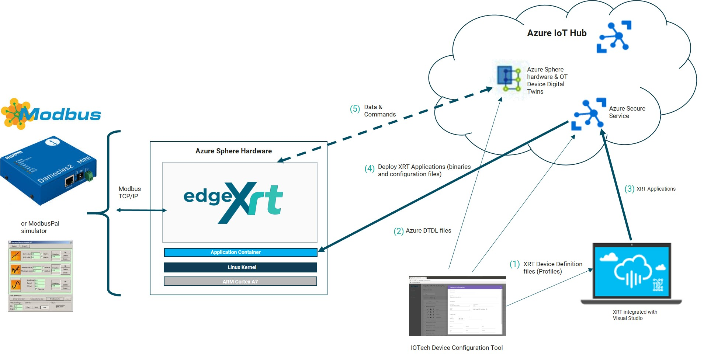
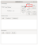
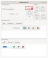
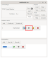
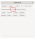

# Modbus Example

In this example, XRT is used to communicate with either a: 
 * Modbus TCP/IP Device ([Damocles2 Mini](https://www.hw-group.com/device/damocles2-mini)
 * [ModbusPal Simulator](#using-the-modbuspal-simulator-with-the-example)
 * [Modbus Dockerised Simulator](#using-the-inhouse-dockerised-simulator-with-the-example)

values read from the choosen Modbus Device are then sent to its
Azure IoT Hub Device Twin in the Cloud. Methods can also be sent back from
the cloud to the Modbus Device using the Device Twin from the Azure IoT Hub.



From the Azure IoT Hub, methods can be called on Device Twins
to send values back down to XRT running on the Azure Sphere
hardware. Values are received by the Azure Export component
and published onto the XRT bus. The Modbus Device Service subscribes
to these values and sets the value of the digital outputs on a ModBus
Device.

*Note - The digital outputs on the device are wired to the digital
inputs on the device. In this way output values are automatically
mirrored by the digital inputs.*

## Hardware

## AzureSphere Hardware

The Modbus Example works on all XRT supported AzureSphere
hardware. See the supported hardware section on the main [readme](../README.md/#supported-hardware).

### Modbus Devices

#### Domocles2 Mini

The [Damocles2 Mini](https://www.hw-group.com/device/damocles2-mini)
is a smart I/O controller used for remote monitoring and
control of sensors and devices. It provides 4 digital dry
contact inputs and 2 digital relay outputs that can be
accessed via a Modbus interface.

If the Damocles hardware is used then it must be connected to
the Azure module via a wired Ethernet connection.

#### ModbusPal

If you do not have access to a physical device, a Java application called 
[ModbusPal simulator](#using-the-modbuspal-simulator-with-the-example)
called ModbusPal, can be used instead of the real hardware.

If the simulator is used it can be installed on your PC. 
Wired Ethernet or WiFi can be used to communicate with XRT.

#### Dockerised Modbus-Sim

There is also an in house dockerised simulator - [Modbus-Sim](#using-the-inhouse-dockerised-simulator-with-the-example), available which can be 
used instead of ModbusPal. This simulator doesn't require any setup
and can be ran from either the host PC or a separate host and can
communicate via a Wired or Wireless network configuration.

## Prerequisites

*Note - The prerequisites found on the main
[readme.md](../README.md) are also required for this example.*

Either:
* The Inhouse [Dockerised Modbus Simulator](#using-the-inhouse-dockerised-simulator-with-the-example)
* The [ModbusPal Java simulator](#using-the-modbuspal-simulator-with-the-example)
* or The Damocles2 Mini connected by wired EtherNet to a AzureSphere module

You will also need:
* Azure IoT Hub setup using the same tenant as your claimed Azure Sphere
  Module
* Connected to host via a micro-USB cable. Note to access this port
      the top casing must be removed


## Setup Configurations 

To get started with the Modbus example we have to first setup all
the configurations files by following the steps on [setup config files](./setup-config-files.md).

## Using the Inhouse Dockerised Simulator with the Example

To use the inhouse simulator docker will need to be pullled from docker hub 
on a device from where the simulator will be ran from. 
The sim can started using the following command:

```bash
docker run --rm --name modbus-sim iotechsys/modbus-sim:1.0.0
```

This by default will launch a simulated modbus device on port 1502 and the
IP address of the device will be that of the host device from where the
simulator is running from.

The simulator can run through a wired network or through a wireless network
interface.

## Using the ModbusPal Simulator With The Example

 To use ModbusPal Simulator with this example you will
 need to:

* Download the [ModbusPal.jar](https://iotech.jfrog.io/artifactory/public/ModbusPal.jar) file.

For both Windows and Ubuntu the Firewall may need to be disabled
or a new rule needs to be added to allow incoming TCP connections
on port 1502 to the simulator:

* For Windows add a new rule following the steps below:
    * Find "Firewall & network protection"
    * Select "Advanced settings"
    * Right click "Inbound Rules" and select "New Rule"
    * Select "Port" and click "Next"
    * Select "TCP", set port number to 1502 and click "Next"
    * Select "Allow the connection" and click "Next"
    * Set Name to "ModbusPal" and click "Finish"

* For Ubuntu add a new rule following the steps below:
    * Run the Firewall Configuration UI
    * Select "Rules" and add a new rule with "+"
    * Select "Simple"
    * Set "Name" to "ModbusPal"
    * Set "Policy" to "Allow"
    * Set "Direction" to "In"
    * Set "Protocol" to "TCP"
    * Set "Port" to "1502"
    * Select "+Add"

* Run the simulator by clicking on downloaded ModbusPal.jar file 
  (Windows) or by running it via the command line:

  ```bash
  java -jar ModbusPal.jar
  ```

* Use the "Load" button and select the [damocles.xmpp](../damocles.xmpp)
  file. This provides a simulation of a Damocles 2 Mini Modbus
  Device with 4 binary inputs and 2 binary outputs.



* Start the simulator with the "Run" button,




## Inputs & Outputs With A Modbus Device

This section explains how to change:
* Change the Output values from the IoT Hub in the Cloud
* Change the Input values of a simulated device with ModbusPal

With a real Modbus Device, the input values will be changed by the
device, then pushed up to the IoT Hub in the Cloud. However, if your
using ModbusPal Simulator, you will need to change the Input value from
the UI to simulate a Input value being changed, the value will then be
sent up to the IoT Hub in the Cloud.

Make sure that you've deployed XRT to Azure Sphere hardware to
see changes taking place with the IoT Hub in the Cloud.

#### Changing A Modbus Device Output Values

This section applies to a simulated device and a real device.

The script update.sh can be used to send a payload of data
to Azure IoT hub to invoke a device method on a Device Twin. The
IoT Hub will send the payload to XRT which will be picked up by
the Azure component and push to the Modbus Device Service
via an XRT Bus.

To set the device resource `BinaryOutput1` to true on the
`damocles-virt1` device, issue the method (replace IotHub-Name
with the name of your IoT Hub):

```bash
./update.sh <IotHub-Name> damocles-virt1 BinaryOutput1 true
```

#### Changing A Modbus Device Input Values On ModbusPal Simulator

*Note - Only follow this section if your using ModbusPal Simulator
and not an actual Modbus Device.*  

* Open the Slave Editor by pressing the button with the "eye" icon and
  then select the "Coils" tab in the dialog that appears.





* Change the value of "Input 1" by double clicking in the table value
  entry and entering a value of "1".


* Observe the debug output from XRT to see the new value being read from the
  simulated Modbus device and then published to the Azure IoT Hub.
