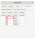

# Modbus Example

This example uses the Guardian 100 Azure Sphere Hardware.
The Guardian 100 is a wireless edge module that uses
Azure Sphere to deliver secure connectivity to devices.
It includes Avnet Azure Sphere MT3620 module and connects
to existing equipment via Ethernet or USB. Guardian-enabled
devices also receive automatic security updates through the
Azure Sphere Security Service.

## AzureSphere Hardware

This example shows how to build a connected IoT application
using IOTech's Edge XRT deployed on an Azure Sphere Guardian
100 module. In this example the XRT application is used to
communicate with a Modbus TCP/IP Device ([Damocles2 Mini](https://www.hw-group.com/device/damocles2-mini)),
reading data values which are then sent to its digital twin
running on Azure IoT Hub. Via the digital twin commands can
also be sent back to the Modbus Device connected to the
Guardian Module.

The example is split into two parts. Part 1 describes how to
create an XRT application that can send data from the Modbus
device connected to the Guardian 100 to Azure IoT Hub and
receive commands in the reverse direction. Part 2 shows how
to interact with the Modbus Device via Azure Digital Twins.

## Prerequisites

*Note - The prerequisites found on the main
[readme.md](readme.md) are also required for this example* 

* Either [ModbusPal](https://iotech.jfrog.io/artifactory/public/ModbusPal.jar)
  Java Modbus simulator, or a Damocles2 Mini connected by
  wired EtherNet to a Guardian 100 module
* Azure IoT Hub setup (installed in SDK Sysroots/7/opt/iotech/xrt/docs)
* Guardian 100 module hardware claimed by Azure Sphere
  Cloud Tenant and enabled for development

    - Connected to host via a micro-USB cable. Note to access this port the top casing must be removed

`azsphere device claim`

`azsphere device edv`

* Telnet is installed on Ubuntu or enabled on Windows
  (unless debugging via Visual Studio)

The Modbus Azure Sphere example application demonstrates how
to use XRT to communicate with a Modus TCP/IP Device
(Damocles2 Mini) or alternatively if you do not have access
to a physical device a Java Modbus simulator (ModbusPal) can
be used instead of the real hardware.

If the Damocles hardware is used then it must be connected to
the Guardian 100 module via a wired Ethernet connection.

If the simulator is used it can be installed on a PC (e.g. the
host running Visual Studio) and accessed via either wired
Ethernet or WiFi.

The Damocles2 mini is a smart I/O controller used for remote
monitoring and control of sensors and devices. It provides 4
digital dry contact inputs and 2 digital relay outputs that
can be accessed via a Modbus interface.

The Azure Sphere example application reads the digital input
from the Modbus device via the Modbus Device Service component
and publishes the data onto the internal XRT bus. A Lua
Scripting component subscribes to these values and checks for
any digital input states changes. Only if changes are detected
is the data re-published onto the bus. An Azure Export component
subscribes to these changes and pushes the data values to an
Azure IoT Hub endpoint.

From Azure IoT Hub methods can be called to send commands
back down to the XRT application running on the Azure Sphere
module to set the digital output values.

Command values are received by the Azure Export component and
published onto the XRT bus. The Modbus Device Service subscribes
to these commands and sets the value of the two digital outputs
on the Damocles2 Mini.

In Part 2 of this tutorial we show how to use a Damocles2 Mini
digital twin instantiation on IoT Hub, methods can be called to
send commands back down to the physical device.

Note the digital outputs on the device are wired to the digital
inputs on the device. In this way output values are automatically
mirrored by the digital inputs.

## Creating a Modbus Device Profile and DTDL generation using the DCT

As described in the previous section (Step 2) to connect to a new
device via XRT you must first create a Device Profile for the
specific device type and in the case of this example a
corresponding DTDL file.

Device Profiles and DTDL files can created using IOTech’s
[Device Configuration Tool](https://dct.iotechsys.com/). A video
showing you how to do this can for the Damocles2 Mini device
can be viewed at [DCT Modbus Tutorial Video](https://www.youtube.com/watch?v=sj1hC7S4uE4).

The configuration files generated from the tool are provided
as follows:
*	[Damocles2 Mini Device Profile](Damocles2-Mini.json)
*	[Damocles2 Mini DTDL file](Damocles2-Mini.dtdl)

## Configuration

### Device Service

* Edit the [config/modbus.json](config/modbus.json) file and 
  replace 10.0.0.1 with the IP address of your PC

  

### Azure

To connect the example to your IoT Hub endpoint you must also
configure Azure Export Service component.

* Edit [config/azure.json](config/azure.json) and the value
  for the "HostName", "DeviceID" and "ScopeID" values.

* The DeviceID can be found for a USB connected device with
  the command:

`azsphere device list-attached`

* The HostName is the IOT Hub host name and can be found using
  the [Azure Portal](https://portal.azure.com/) or using the
  command (replace HubName with the name of your IOT hub):

`az iot hub show --name HubName | grep hostName`

* The Device Provisioning Service ID Scope can be found using
  the portal or the command (replace DPSName with the name of
  your Device Provisioning Service):

`az iot dps show --name DPSName | grep idScope`

### App Manifest 

* Edit the [app_manifest.json](app_manifest.json) file and
  replace 10.0.0.1 with the IP address of your PC, set
  DeviceAuthentication to your tenant id and replace
  IOTechHub with your IoT Hub name in AllowedConnections:

`azsphere tenant list`

## Building The Application

### Building On Windows 
### Building On Ubuntu

## Deploying and Debugging the Application

### Deploy and Debug with Windows
### Deploy and Debug with Ubuntu 

## Running the ModbusPal Simulator

* Download the [ModbusPal.jar](https://iotech.jfrog.io/artifactory/public/ModbusPal.jar) file.

* Run the simulator by clicking on download (Windows) or
  with the command:

`java -jar ModbusPal.jar`

* Use the "Load" button and select the [damocles.xmpp](damocles.xmpp)
  file. This provides a simulation of a simple Modbus
  devices with 4 binary inputs and two binary outputs.

* Start the simulator with the "Run" button
Configuring XRT for use with Guardian 100 or Modbus simulator
In order to deploy the example application and enable it
connect to the Modbus simulator (or a real Damocles2 Mini device) 
then you must configure the following config files for the
XRT Modbus Device Service component and the Azure Sphere manifest
to use the IP address of your PC.

### Change the Modbus Device Values

#### Changing the Modbus Device Inputs

* Open the Slave Editor by pressing the button with the "eye" icon and
  then select the "Coils" tab in the dialog that appears.

* Change the value of "Input 1" by double clicking in the table value
  entry and entering a value of "1".

* Observe the debug output to see the new value being read from the
  simulated Modbus device and then published to the Azure Cloud.

#### Changing the Modbus Device Outputs

The script update.sh can be used to update device resources in the Azure
IoT hub to invoke a device method.

* To set the resource BinaryOutput1 to true issue the command (replace
  HubName with the name of your IoT hub):

`./update.sh HubName BinaryOutput1 true`

