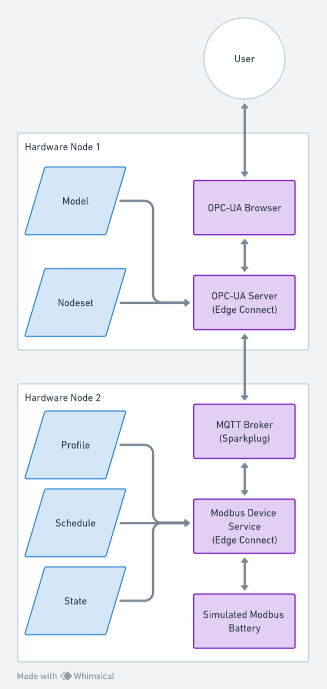

## What does this show?

This demonstration showcases the integration and interaction between Edge Connect Modbus Device Services and an OPC-UA server using MQTT. The focus is on monitoring and manipulating temperature data from battery cells.
Components:

 -   Edge Connect Modbus Device Service (Instance on Hardware Node 2): Responsible for reading device data according to a specified schedule.
 -   MQTT Communication: Facilitates the transfer of data between the Modbus device and the OPC-UA server.
 -   Separate Edge Connect Instance with OPC-UA Server: Receives and processes data for inclusion in the battery model.
 -   OPC-UA Browser: Enables viewing and interaction with the battery model data.

Key Features:

 -   Real-Time Data Monitoring: Observe the incrementing value of Battery Cell 1's temperature, indicating successful data reading and transfer.
 -   Data Manipulation via OPC-UA Browser: Demonstrates the user's ability to write to the device service. This is illustrated by altering the SF_tmp value under the Sparkplug folder to 2.

Demonstration Steps:

 -   Initiate Temperature Reading: The Edge Connect Modbus Device Service reads the temperature of Battery Cell 1 and updates it every second.
 -   Data Transfer via MQTT: The read temperature data is sent to the OPC-UA server-hosting Edge Connect instance.
 -   Battery Model Update: The OPC-UA server updates the battery model, defined by the Model and the Nodeset, with the received data.
 -   Observation in OPC-UA Browser: The incrementing temperature of Cell 1 is viewable in real-time.
  -  Writing to the Device Service: Change the SF_tmp value in the OPC-UA browser. This adjustment alters the computation for Cell 2's temperature, initially set to multiply by 0. Post-modification, it doubles the temperature of Cell 1.

Expected Outcome:

By following these steps, you will observe the dynamic interaction between the Modbus device service and the OPC-UA server, demonstrating real-time data monitoring and manipulation capabilities.

