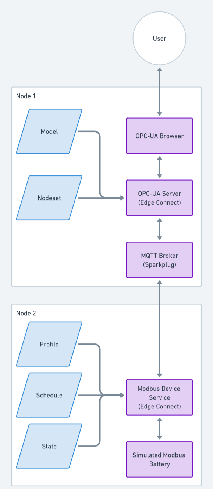

## What does this show?

This demonstration showcases the integration and interaction between Edge Connect Modbus Device Services and an OPC-UA server using MQTT. The focus is on monitoring and manipulating temperature data from battery cells. Although a simple demo running on one machine this is design to show how you can use XRT across multiple hardware nodes for example a gateway running a opc-ua server with multiple hardware nodes running device servers sending data.

Components:

 -   Modbus device: Device to be read
 -   Edge Connect Modbus Device Service: Responsible for    reading device data according to a specified schedule.
 -   MQTT Broker: Facilitates the transfer of data between the device service and the OPC-UA server.
 -   Edge Connect OPC-UA Server: a seperate edge connect instance that receives and processes data for inclusion in the battery model.
 -   OPC-UA Browser: Enables viewing and interaction with the battery model data.

If you follow the steps in the README.md you will get create the deployment outlined above and in the diagram. Then you will be able to see real-time data monioting and data manipulation you can do to the modbus device from the opc-ua server

