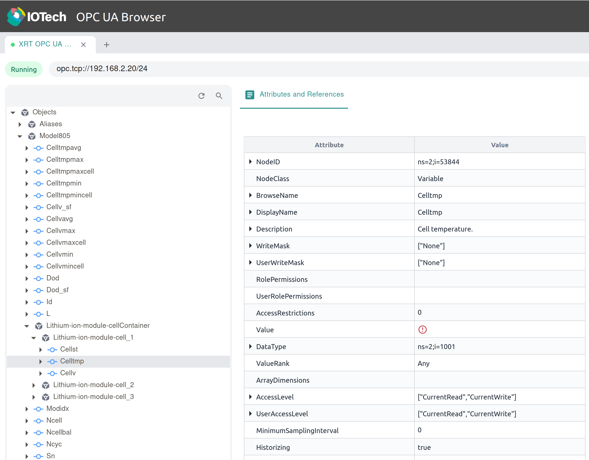
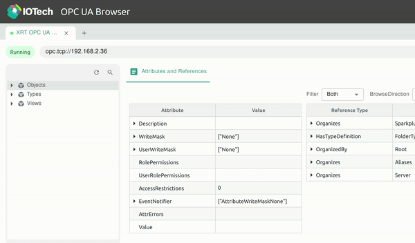

# Confederated OPC UA Server and Modbus Device Service

This example demonstrates how to operate the OPC UA server using a OPC UA nodeset and model to read a modbus device. The nodeset used is a
[Sunspec model](https://sunspec.org/wp-content/uploads/2015/06/SunSpec-Information-Models-12041.pdf) that has been converted to an OPC UA Nodeset.
 Specifically, it uses Sunspec's [Model805](https://github.com/sunspec/models/blob/master/json/model_805.json) to create an instance of a Lithium-ion module.

The model in the OPC UA server is a battery module model with three cells. This battery module will be simulated using a Modbus-tcp simulator where it will be read by a schedule of a XRT device service. This XRT device service sends over Sparkplug this data to the XRT OPC UA Server where you the user can retrieve it using a OPC UA Browser.

For more information about the OPC UA Server and Node Modelling please review the [OPC-UA Server](https://docs.iotechsys.com/edge-xrt30/server-components/opc-ua-server-component.html) documentation.

For more information about the Modbus Device Service please review the [Modbus Device Service](https://docs.iotechsys.com/edge-xrt30/device-service-components/Modbus-device-service-component.html) documentation.

## Prerequisites

- Docker must be installed on your machine. (can be checked using `docker -v`)
- XRT 3.0 must be installed, along with a copy of this repository (can be checked using `xrt` )
- Python 3 must also be installed. (can be checked using `python3 -v`)

## OPC UA Browser Setup

This section outlines the setup process for the IOTech OPC UA browser. If you opt to use a different OPC UA browser, please refer to the corresponding instructions specific to that browser.

### Steps

1. **Pull Docker Image**:

    ```shell
    docker pull iotechsys/opc-ua-browser:1.1
    ```

2. **Run the Browser**:

    ```shell
    docker run -d --name opc-ua-browser -p 8080:8080 iotechsys/opc-ua-browser:1.1.dev
    ```

3. **Verify Run**:
    - Execute the command `docker ps` in your terminal.
    - Confirm that an image named 'iotechsys/opc-ua-browser' is listed in the output.
4. **Access the Browser**: Connect to the OPC UA browser at [http://0.0.0.0:8080/](http://0.0.0.0:8080/) in your web browser of choice. We will come back to this page later.

## XRT OPC UA Server

Now we have the Browser working we can move on to setting up XRT OPC UA Server for the OPC UA Browser to connect to. This step assumes you have the XRT-Examples repository cloned from Github and are starting from the top level of it's directory.

1. **Navigate to the Example Directory**:

    ```shell
    cd ./Servers/opc-ua/federated/opc-ua
    ```

2. **Set Environment Variables**:

    ```shell
    . ./../set_env.sh
    ```

    An explanation for the manual setting of common device service environment variables can be found [here](https://github.com/IOTechSystems/xrt-examples/blob/v3.0-branch/DeviceServices/interactive-walkthrough/ds-getting-started-common.md/#Device-service-configuration-setup).

3. **Run XRT with config folder**

   See [Setup XRT](https://github.com/IOTechSystems/xrt-examples/blob/v3.0-branch/DeviceServices/interactive-walkthrough/setup-xrt.md) if you have not already setup XRT.

   ```shell
   xrt ./deployment/config
   ```

4. **Check OPC UA Browser**:

    Now if XRT is set up correctly you should see no error on the console output and be able to connect to the OPC UA Server using the [OPC-UA Browser](http://0.0.0.0:8080/) and by entering your machines IP address into the 'Enter connection address' box (you can find this using `ip addr`).

    When the Security pop up come up just click 'SAVE AND CONNECT' as for this example no security is set.

You should be able to see the model data defined by `opc-ua/deployment/models/Sunspec_Model805.json` loaded in under:

    Objects -> Model805

    The model has no values populated as we have yet to connect our simulated device.



## Modbus Simulator Setup  

We now have a OPC UA Server working so lets create a simulated Modbus device for us to retrieve data from.

1. **Navigate to the modbus-tcp Directory**:

    ```shell
    cd ./Servers/opc-ua/federated/modbus-tcp
    ```

2. **Pull Docker Image**:

    ```shell
    docker pull iotechsys/pymodbus-sim:1.0
    ```

3. **Run the Container**:

    ```shell
    docker run --name my_pymodbus_sim -v $(pwd)/sim_files:/sim_files --rm --network host iotechsys/pymodbus-sim:1.0 --profile /sim_files/modbus-profile.json --script /sim_files/MyScript.py --port 1502 --delay 1
    ```

    In this command we are mounting the sim_files directory which contains the logic for the simulator
4. **Verify Run**:
    - Execute the command `docker ps` in your terminal.
    - Confirm that an image named 'iotechsys/pymodbus-sim' is listed in the output.

## Modbus Device Service  

Now we have the simulated modbus battery we can move on to reading our battery using a XRT device service and have this over MQTT Sparkplug send the data to the XRT OPC UA server

1. **Navigate to the modbus-tcp directory**:

    ```shell
    cd ./Servers/opc-ua/federated/modbus-tcp
    ```

2. **Set Environment Variables**:

    ```shell
    . ./../set_env.sh
    ```

    An explanation for the manual setting of common device service environment variables can be found [here](https://github.com/IOTechSystems/xrt-examples/blob/v3.0-branch/DeviceServices/interactive-walkthrough/ds-getting-started-common.md/#Device-service-configuration-setup).

3. **Run XRT with config folder**

   ```shell
   xrt ./deployment/config
   ```

4. **Seeing the results! :**

   Now if we go onto our OPC UA browser we should see if we go into you should see this value incrementing by one every second:

Sparkplug -> xrt -> modbus-device1 -> cell_1_tmp




In the sparkplug/xrt/modbus-device-1 folder, if you find the variable cell_1_tmp. You can write a value to this property either by clicking the pencil icon in the value cell or by right-clicking the resource in the hierarchical menu and selecting 'Write' from the context menu.
