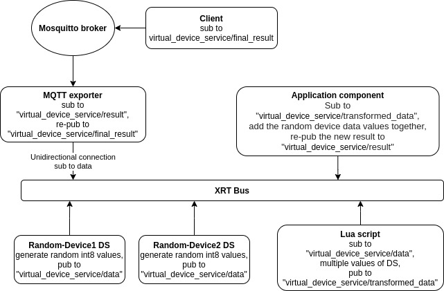

# Example XRT appication component

This example uses the **Virtual Device Service** to generate some random data (Int8). The data is published under `"virtual_device_service/data"` topic to the bus.
A Lua component is attached which subscribes to both data streams and transforms the data (multiplies each data value by 10) before re-publishing the new values under the topic `"virtual_device_service/transformed_data"`. There is also a custom application component attached which subscribes to the topic `"virtual_device_service/transformed_data"`, adds the two random values together before re-publishing the final result back to the XRT bus under the topic `"virtual_device_service/result"`. Lastly, an MQTT exporter component is attached which re-publishes the result on `"virtual_device_service/final_result"` (using Mosquitto) so that the data can be accessed by any client subscribed to that MQTT topic on the broker.

Below an illustration of the scenario described above:

## Prerequisites
  XRT dev must be installed and environment variables must be set via env.sh
  * iotech-iot-dev     1.2.1    amd64    IOT C Framework
  * iotech-thrift-dev  1.0.1    amd64    Embedded Thrift C Version
  * iotech-xrt-dev     1.1.1    amd64    XRT C RealTime Framework

## Build
Open a terminal window in the directory containing the example. Run

`. ./envs.sh`

to set up the environment, then

`make`

to build the example application component.

## Run
A configuration is provided which sets up two devices generating random values. Run

`xrt config`

to start the XRT instance with the example application component.
The logs should indicate that random values are being published to the bus, transformed and the result is republished.

## Application component structure
There are a couple of function pointers to be implemented in order to support the state transitions of the application component that has been created in this example in the C language.

### alloc
Allocate component instances.

> **Note:** It is good practice to disable the publish/subscribe functionality in this function as the component may need time to initialize.

### start, stop, free
Start/stop/free the component and to update its state.

> **Note:** A component is made available to a container using the associated factory. It's up to you when and where you want to enable publish/subscribe functionality. It's good practice to enable it when the component starts and disable it upon stop.

### config
Provides the possibility to configure and access each individual field that has been set in the [`app_component.json`](https://github.com/IOTechSystems/xrt-examples/blob/XRT-633-branch/SimpleXRTComponentExample/config/app_component.json) file.
  
For example:
`const char * request_topic = iot_config_string (map, "RequestTopic", false, logger);`

In the above scenario the function `iot_config_string` is used to query the content of specified field: RequestTopic.

> **Note:** The `config` function gathers the information from the json file and will be used to allocate memory for each component.

The application component config in this example has the below unique lines:
  `"RequestTopic":"virtual_device_service/transformed_data"` - topic to subscribe to
  `"ReplyTopic": "virtual_device_service/result"` - topic to publish data to

### callback
The **callback** function is implemented in a way that it subscribes to the request topic stream, filters the values from the readings of Random-Device1 and Random-Device2, adds them together and re-publishes the result back to the bus.

> **Note:** The device data has to be filtered out from a **map**. After the data has been processed, it has to be added back to it and the **map** itself will have to be published back to the bus under the specified reply topic.

### factory
In this example, the application component is dynamically loaded, therefore the app_component.json has the **Library** and **Factory** fields defined.